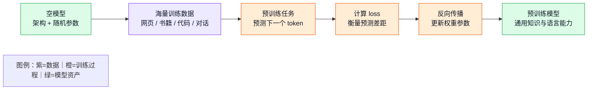
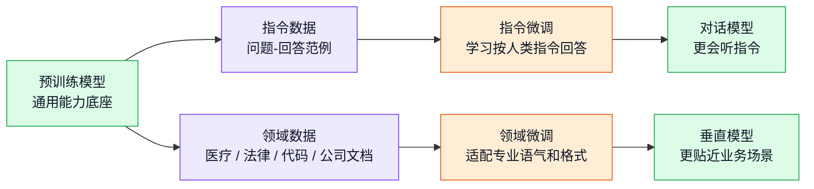
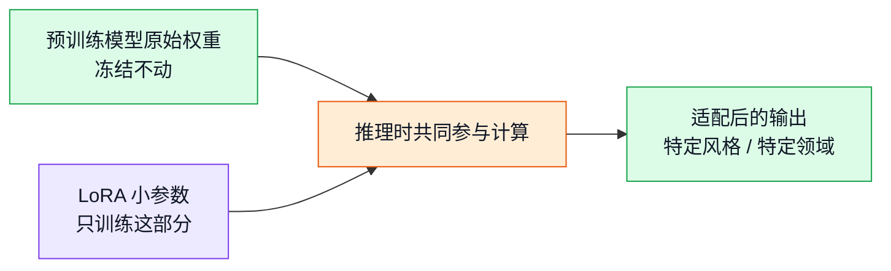
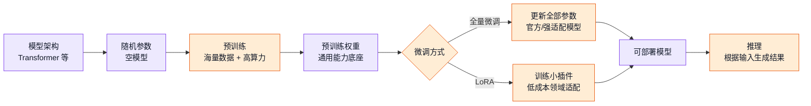

# 第三章：预训练与微调：模型能力是怎样形成的

大模型的能力来自两个阶段：**预训练**让模型形成通用知识和语言能力，**微调**让模型更适合特定交互方式或业务任务。前一章已经区分了模型架构和权重参数，本章继续沿着这条线解释：权重参数是怎样从随机数字变成“会回答问题”的模型能力。

## 从空模型开始

一个刚创建出来的大模型可以理解为：

```text
空模型 = 模型架构 + 随机初始化参数
```

模型架构规定了数据怎样流动，例如 token 如何进入 embedding，self-attention 如何看上下文，feed-forward network 如何继续变换表示。随机初始化参数只是一些没有经过训练的数字。此时模型有计算结构，但没有可靠能力。它可以算出结果，但这些结果通常没有实际意义。

最简单的类比是线性公式：

```text
y = x * w + b
```

公式结构决定了计算方式，`w` 和 `b` 的具体数值决定了输出结果。大模型把这个逻辑扩展到数十亿、数百亿甚至更多参数。训练的过程，就是不断调整这些参数，使模型在给定输入时更容易产生正确或合理的输出。

## 预训练：把随机参数炼成通用能力

**预训练（pre-training）** 是大模型生命周期中的第一大阶段。它通常使用海量文本、代码、网页、书籍或多模态数据，让模型反复完成一个基础任务：根据已有上下文预测接下来最可能出现的内容。

对语言模型来说，常见任务可以理解成“预测下一个 token”：

```text
输入：天空为什么是
目标：蓝色
```

模型一开始会胡乱预测。每次预测之后，训练程序会计算预测结果和真实答案之间的差距，也就是 loss。随后通过反向传播更新参数。经过大量数据和大量轮次后，权重参数逐渐记录语言规律、事实关联、推理模式、代码结构和常见表达方式。



预训练后的模型已经拥有很强的通用能力，但它不一定天然适合作为聊天助手。基础语言模型的目标通常是顺着上下文继续写，而不是理解用户意图后给出有帮助的回答。例如输入“帮我写一封请假条”，基础模型可能继续列出类似的句子，也可能补全成一段训练语料风格的文本。

> 💡 **小科普：为什么叫“预训练”？**
>
> “预”表示这是后续任务训练之前的基础阶段。预训练模型已经学到通用语言和世界知识，但还没有针对某种交互方式或业务场景完成专门适配。后续可以继续做指令微调、领域微调、偏好对齐或部署优化。

## 微调：让通才适应任务

**微调（fine-tuning）** 是在预训练模型基础上继续训练。它通常不再从随机参数开始，而是继承预训练权重，再用更小、更有针对性的数据调整模型行为。

预训练更像长期通识教育，微调更像岗前训练。预训练决定模型是否掌握足够多的语言、事实和推理模式；微调决定模型如何按照任务要求使用这些能力。



工程上常见的判断是：**预训练提供能力底座，微调改变能力的使用方式**。如果预训练阶段没有学到某类基础能力，微调通常很难凭少量数据凭空创造出完整能力。微调更擅长调整输出格式、指令服从、专业术语风格、回答边界和特定任务流程。

## 全量微调：直接改所有权重

**全量微调（Full Fine-Tuning, FFT）** 会继续训练模型的全部参数。对于一个拥有数十亿参数的大模型，这意味着每一层权重都有机会被更新。

全量微调的优点是调整空间最大。它可以让模型把新任务、新指令风格和原有能力融合得更深。官方对话模型、强指令模型和一些关键基础模型版本，常常需要更重的全量训练或多阶段训练。

它的代价也很高：显存、算力、训练数据质量、训练稳定性和评测成本都更高。全量微调如果数据质量不好，还可能破坏预训练模型原有能力，出现灾难性遗忘或通用能力下降。

```text
全量微调 = 预训练模型全部参数继续更新
特点：效果上限高，成本高，风险也更高
```

## LoRA：在原模型旁边加小插件

**LoRA（Low-Rank Adaptation）** 是一种低成本微调方式。它的核心思想是冻结原模型的大部分权重，只训练一组很小的附加参数。工程上可以把它理解成给模型挂一个“任务插件”。



LoRA 的优势是训练成本低、保存文件小、切换方便。一个基础模型可以挂载多个 LoRA，分别适配不同文风、领域术语或业务格式。个人开发者和中小团队常用 LoRA 做低成本定制。

LoRA 的限制也很清楚：它更适合轻量适配，不适合把一个基础能力明显不足的模型彻底改造成全新模型。底座能力越强，LoRA 越容易用较少数据获得可见效果。

## 预训练、微调与推理的完整链路

模型生命周期可以概括成三段：



这条链路中，预训练是最昂贵也最关键的能力形成阶段，微调是让能力按特定方式表现出来的适配阶段，推理则是模型面对真实输入输出结果的使用阶段。

## 和 TTS / OmniVoice 的关系

TTS 模型同样遵循“架构 + 权重 + 训练阶段 + 推理阶段”的基本逻辑，只是输入输出从纯文本扩展到语音相关表示。对 OmniVoice 这类系统来说：

- 预训练或主训练阶段让模型学会把文本、参考音频、音色条件和语音 token 关联起来。
- checkpoint 权重保存模型在训练中学到的发音、韵律、音色迁移和声学 token 生成能力。
- 推理阶段通过 `from_pretrained()` 加载权重和周边组件，再通过 `generate()` 根据文本、参考音频或风格指令生成音频。
- 如果未来进行领域适配，可以通过继续训练或参数高效微调，让模型更贴近某种语言、口音、角色音色或业务播报风格。

因此，大模型和 TTS 模型的底层思想相通：架构提供计算方式，权重保存训练经验，预训练形成基础能力，微调调整行为表现。不同任务的差异主要体现在数据形式、训练目标、输入输出处理和评测标准上。

## 最小结论

大模型的智能不是凭空出现的。**模型架构决定数据怎么算，权重参数决定模型学到了什么，预训练让随机参数形成通用能力，微调让通用能力适配具体任务。**

全量微调直接调整全部参数，效果空间大但成本高；LoRA 冻结原模型，只训练小插件，成本低、切换灵活。实际工程选择哪种方式，取决于底座模型能力、数据规模、算力预算、质量目标和部署形态。
