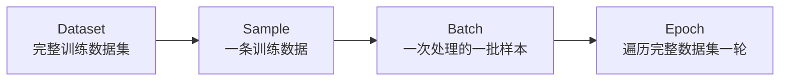

# 模型训练的基本说明

训练代码里经常看到 **Dataset（数据集）**、**Batch（批次）** 和 **Epoch（轮次）**。它们描述的是训练数据从“完整集合”到“一次模型计算”的不同层级。

## 1. Dataset：完整训练数据集

Dataset 是所有训练样本的集合。

TTS 的一条样本通常至少包含：

```text
文本 + 对应音频
```

例如一个数据集有 1000 条文本音频对：

```text
Dataset
├── sample 0：文本0 + 音频0
├── sample 1：文本1 + 音频1
├── ...
└── sample 999：文本999 + 音频999
```

其中每一条记录称为一个 **sample（样本）**。

## 2. Batch：一次送进模型的一批样本

模型通常不会每次只处理一条样本，而是把多条样本组成一个 Batch，一起送入模型计算。

例如：

```text
Dataset：1000 条样本
batch_size：10

batch 0：sample 0～9
batch 1：sample 10～19
...
batch 99：sample 990～999
```

因此：

```text
1 Batch = 一次共同送进模型的一组样本
```

把多条样本组成 Batch，可以更充分地利用 GPU 的并行计算能力。

DataLoader 位于 Dataset 和训练循环之间，负责读取样本、打乱顺序，并把样本整理成 Batch：

```text
Dataset → DataLoader → Batch → 模型
```

> 💡 **OmniVoice 的 Batch 不一定包含固定数量的样本**
>
> 语音长度差异很大。OmniVoice 主要按一个 Batch 的总 token 数量组批，所以短音频较多时，一个 Batch 可以包含更多样本；长音频较多时，一个 Batch 可能只包含较少样本。

## 3. Epoch：完整遍历数据集一轮

Epoch 表示模型把整个训练数据集完整看一遍。

仍以 1000 条样本、每个 Batch 10 条为例：

```text
1000 ÷ 10 = 100 个 Batch
```

模型处理完这 100 个 Batch，就完成了 1 个 Epoch：

```text
Epoch 0：第一次遍历整个数据集
Epoch 1：第二次遍历整个数据集
Epoch 2：第三次遍历整个数据集
```

每个 Epoch 通常会改变数据顺序，让模型看到不同的 Batch 组合。

在 OmniVoice 中，代码会把当前 Epoch 告诉 Dataset：

```python
if hasattr(train_dataloader.dataset, "set_epoch"):
    train_dataloader.dataset.set_epoch(epoch)
```

这不是给模型设置 Epoch，而是让 Dataset 更新随机种子、打乱顺序，并在多进程或多 GPU 环境下重新划分数据。

## 4. Dataset、Batch、Epoch 的关系



用一句话概括：

```text
Dataset 是完整题库
Sample 是一道题
Batch 是一次交给模型的一小组题
Epoch 是模型把整套题库做完一遍
```

固定 Batch 大小时，三者的数量关系大致是：

```text
每个 Epoch 的 Batch 数 ≈ Dataset 样本总数 ÷ batch_size
```

例如：

```text
1000 条样本 ÷ 每 Batch 10 条 = 每 Epoch 约 100 个 Batch
```

训练多个 Epoch，就是让模型反复遍历同一份 Dataset，并在每个 Batch 上根据误差逐步调整权重。
