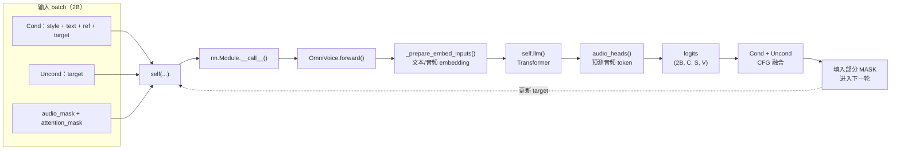

# `self(...)` 的推理过程与模型权重




相关代码：

```python
batch_logits = self(
    input_ids=batch_input_ids,
    audio_mask=batch_audio_mask,
    attention_mask=batch_attention_mask,
).logits.to(torch.float32)
```

## 1. 为什么会调用 `forward()`

`OmniVoice` 通过 `PreTrainedModel` 最终继承自 PyTorch 的 `nn.Module`。
调用模型对象 `self(...)` 时，调用路径是：

```text
self(...)
  → nn.Module.__call__(...)
  → OmniVoice.forward(...)
```

`nn.Module.__call__()` 负责执行 PyTorch 的模型调用流程，然后调用当前模型实现的
`forward()`。

## 2. 三个输入

```text
batch_input_ids       (2B, C, S)     Cond 与 Uncond 的 token
batch_audio_mask      (2B, S)        区分文本位置和音频位置
batch_attention_mask  (2B, 1, S, S)  控制序列位置之间能否互相关注
```

前 `B` 条是 Cond 完整输入，后 `B` 条是只保留 target 的 Uncond 输入。两路结果
用于后续 CFG 融合。

## 3. `forward()` 的核心过程

```text
input_ids
  → _prepare_embed_inputs()：生成文本/音频 embedding
  → self.llm()：Transformer 进行上下文建模
  → audio_heads()：预测各 codebook 的音频 token
  → logits：(2B, C, S, V)
```

其中：

- `C`：音频 codebook 数量。
- `S`：序列长度。
- `V`：每个 codebook 可预测的 token 类别数量。

`.logits.to(torch.float32)` 取出预测结果，并将数据类型转换为 `float32`，方便后续
计算 CFG、概率和置信度。

## 4. 使用了哪些模型权重

如果模型通过 `from_pretrained()` 加载了训练好的 checkpoint，这次前向计算会使用：

- 文本 embedding 权重。
- 音频 embedding 权重。
- Transformer/LLM 主干权重。
- `audio_heads` 输出层权重。

这里仅使用当前权重进行预测，不执行反向传播或 `optimizer.step()`，因此不会更新
模型权重。

## 5. 在迭代推理中的作用

每一轮都会执行一次 `forward()`：

```text
当前 target 状态
  → Cond 与 Uncond 前向计算
  → CFG 融合两路 logits
  → 选择一部分 MASK 位置并填入预测 token
  → 将新 token 写回，进入下一轮
```

经过 `num_step` 轮后，target 中的 MASK 会逐步被真实音频 token 替换。
