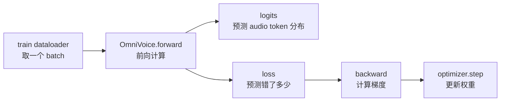
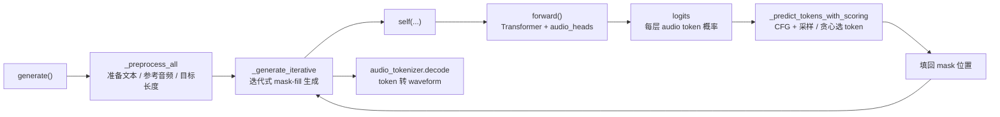
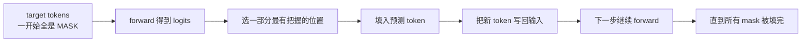
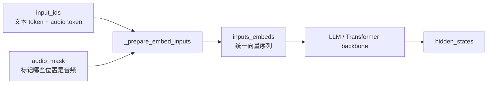
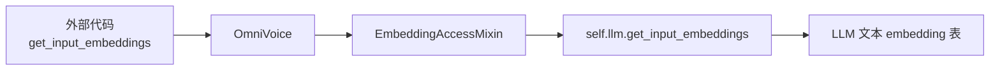
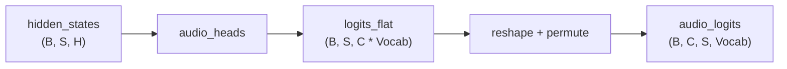
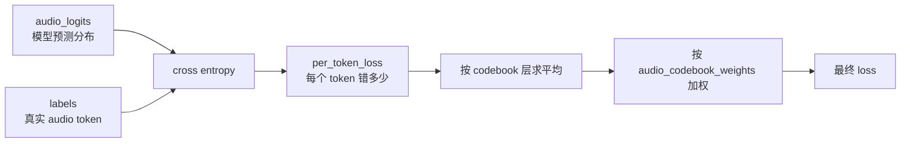

# OmniVoice `forward()` 解读

本文解释 `omnivoice.py` 中 `OmniVoice.forward()` 在模型结构、训练流程和推理流程里的位置，以及它如何计算训练 loss、如何在生成时提供 audio token 概率分布。

## 它在训练中的位置

训练循环位于 `omnivoice/training/trainer.py`。每个训练 step 会从 dataloader 取出一个 batch，然后执行：

```python
outputs = self.model(**batch)
loss = outputs.loss
self.accelerator.backward(loss)
self.optimizer.step()
```

其中 `self.model(**batch)` 实际调用的就是 `OmniVoice.forward()`。



`forward()` 本身只做前向预测和 loss 计算，不直接更新参数。参数更新发生在训练器里的 `backward()` 和 `optimizer.step()`。

## 它在推理中的位置

推理也会调用 `forward()`。区别是：推理时通常不传 `labels`，所以 `forward()` 只返回 `logits`，不计算 loss。`generate()` 会把这些 logits 交给采样和 mask-fill 逻辑，用来逐步预测 audio token。

核心调用链是：



在 `_generate_iterative()` 中有这样一段：

```python
batch_logits = self(
    input_ids=batch_input_ids,
    audio_mask=batch_audio_mask,
    attention_mask=batch_attention_mask,
).logits.to(torch.float32)
```

这里的 `self(...)` 在 PyTorch 里会调用 `self.forward(...)`。因此，推理生成时每一步都会通过 `forward()` 跑一次 Transformer，得到当前 mask 状态下的 audio token 预测分布。

推理阶段的 `forward()` 可以理解成：

```text
给定当前已经填好的一部分 audio token + 仍然是 mask 的位置，
让模型预测每个 mask 位置应该填哪个 audio token。
```

### 推理时为什么要反复调用

OmniVoice 的生成方式不是一次性直接输出完整 waveform，而是在 audio token 空间里做迭代式填充：



所以 `forward()` 在推理中的角色不是“算 loss”，而是“反复给出下一批 audio token 的概率分布”。

## 它在 Transformer 中的位置

OmniVoice 的主干是一个 LLM / Transformer。普通文本 LLM 的输入通常是文本 token id；OmniVoice 的输入是混合序列：既有文本 token，也有 audio codebook token。

`forward()` 先把这种混合输入转换成 Transformer 能处理的 embedding：



这里的关键点是：

| 位置类型 | embedding 来源 |
| --- | --- |
| 文本位置 | LLM 原生 text embedding |
| 音频位置 | OmniVoice 新增的 `audio_embeddings` |

进入 Transformer 后，文本 token、参考音频 token、目标音频 token 所在的位置会通过 self-attention 交换上下文信息。

## Mixin 是什么

代码里有一个 `EmbeddingAccessMixin`。Mixin 可以理解成“能力拼装类”：它通常不单独创建对象，而是被其他类继承，用来给目标类补充一组小能力。

在这里，`EmbeddingAccessMixin` 提供的是 embedding 访问能力：

```python
get_input_embeddings()
set_input_embeddings(value)
```

OmniVoice 外层模型包了一层音频 token 逻辑，但文本 token 的 embedding 仍然由内部 LLM 管理。所以这个 Mixin 的作用是把外层模型的 embedding 访问请求转发给 `self.llm`。



这样做的好处是，外部训练和加载逻辑可以把 OmniVoice 当作一个标准 Hugging Face 模型来处理。例如新增 special token 后 resize embedding，或者加载 checkpoint 时对齐 embedding，都可以复用通用接口。

## 输入和输出

`forward()` 的主要输入包括：

| 参数 | 含义 |
| --- | --- |
| `input_ids` | 混合序列 token，通常形状为 `(B, C, S)` |
| `audio_mask` | 标记哪些序列位置是音频 token，形状为 `(B, S)` |
| `labels` | 训练目标 audio token，值为 `-100` 的位置不参与 loss |
| `attention_mask` | 普通 attention mask，常用于 SDPA 路径 |
| `document_ids` | sequence packing 时的样本边界，用于 flex attention |
| `position_ids` | 可选位置 id，透传给 LLM |

输出是 `OmniVoiceModelOutput`：

| 字段 | 含义 |
| --- | --- |
| `logits` | 每层 audio codebook 的 token 分类分布 |
| `loss` | 如果传入 `labels`，返回训练 loss；否则为 `None` |

`logits` 的形状是：

```text
(B, C, S, audio_vocab_size)
```

其中：

| 维度 | 含义 |
| --- | --- |
| `B` | batch size |
| `C` | audio codebook 层数，OmniVoice 默认是 8 |
| `S` | 序列长度 |
| `audio_vocab_size` | 每层 audio token 的词表大小 |

训练、验证和推理都会用到 `logits`，但用途不同：

| 场景 | 是否传 `labels` | `logits` 用途 | `loss` 用途 |
| --- | --- | --- | --- |
| 训练 | 是 | 和 labels 对比，计算 loss | 反向传播，更新权重 |
| 验证 | 是 | 和 labels 对比，计算 eval/loss | 只评估，不更新权重 |
| 推理 | 否 | 采样或贪心选择 audio token | 不计算 loss |

## audio head 做了什么

Transformer 输出的是 `hidden_states`，形状通常是：

```text
(B, S, hidden_size)
```

`hidden_states` 的意思是“隐藏状态”或“中间表示”。它不是最终 token，也不是音频波形，而是 Transformer 给每个序列位置算出来的一条上下文向量。

可以把它理解成：

```text
每个位置在看过上下文之后，模型内部对这个位置的理解。
```

例如某个目标音频 mask 位置的 hidden state，会融合它能 attend 到的文本、参考音频 token、已经填好的目标 audio token 等上下文信息。后续 `audio_heads` 再把这个向量转换成“每个 audio token 的概率”。

因为训练目标是 8 层 audio codebook token，所以 `forward()` 用 `audio_heads` 把 hidden state 投影到 audio token 词表：



这一步可以理解为：模型在每个序列位置、每个 codebook 层上，都预测一个 audio token 分类分布。

## loss 的含义

OmniVoice 的训练目标是预测 audio codebook token，所以这里使用的是 cross entropy loss。



直觉上，cross entropy 回答的是：

```text
模型给正确 audio token 的概率够不够高？
```

如果正确 token 的概率很高，loss 小；如果模型把概率分给了错误 token，loss 大。

## `-100` 为什么会被忽略

`labels` 中值为 `-100` 的位置会被 `ignore_index=-100` 忽略，不参与 loss。

这是因为一个 batch 里并不是所有位置都需要监督。例如文本位置、prompt 位置或 padding 位置通常不是这一步要预测的目标 audio token。训练只应该惩罚真正需要模型预测的目标音频位置。

## 为什么要按 codebook 加权

OmniVoice 默认有 8 层 audio codebook。配置里有：

```json
"audio_codebook_weights": [8, 8, 6, 6, 4, 4, 2, 2]
```

模型初始化时会把它归一化成 `normalized_audio_codebook_weights`。计算 loss 时，先得到每一层 codebook 的平均 loss，再按这些权重加权求和。

```text
最终 loss = 第 1 层 loss * w1 + 第 2 层 loss * w2 + ... + 第 8 层 loss * w8
```

权重前高后低的直觉是：前面的 codebook 层通常承载更重要、更粗粒度的语音信息；后面的 codebook 层更多补充细节，因此训练时给后面层较低权重。

## forward、backward、generate 和 optimizer 的分工

`forward()` 不等于完整训练，也不等于完整推理。它是“跑一次模型，给出 logits / loss”的核心计算单元。

完整训练 step 至少包含：

| 阶段 | 发生在哪里 | 做什么 |
| --- | --- | --- |
| forward | `OmniVoice.forward()` | 根据当前权重预测 audio token，并计算 loss |
| backward | `OmniTrainer.train()` | 根据 loss 计算每个参数的梯度 |
| optimizer step | `OmniTrainer.train()` | 根据梯度更新模型权重 |

也就是说：

```text
forward 负责算“现在错多少”。
backward 负责算“每个参数该怎么改”。
optimizer.step 负责真正修改权重。
```

验证阶段也会调用 `forward()` 计算 `eval/loss`，但验证阶段包在 `torch.no_grad()` 中，不会执行 backward，也不会更新权重。

完整推理则是：

| 阶段 | 发生在哪里 | 做什么 |
| --- | --- | --- |
| 预处理 | `generate()` / `_preprocess_all()` | 准备文本、参考音频 token、目标长度 |
| 迭代生成调度 | `_generate_iterative()` | 决定每一步填多少 mask、如何做 CFG 和采样 |
| 单次预测 | `forward()` | 根据当前 token 状态输出 logits |
| token 选择 | `_predict_tokens_with_scoring()` | 从 logits 中选出要填入的 audio token |
| 波形还原 | `audio_tokenizer.decode()` | 把完整 audio token 还原成 waveform |

## 一句话总结

`OmniVoice.forward()` 是主模型的核心前向计算路径：训练时，它输出 logits 并用加权 cross entropy loss 衡量模型预测 audio token 的错误程度；推理时，它反复输出 logits，供 `_generate_iterative()` 逐步填充 mask audio token，最后再由 `audio_tokenizer.decode()` 还原成声音。
