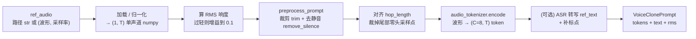

# OmniVoice 源码逐类学习：`omnivoice/models/omnivoice.py`

本文按 `omnivoice/models/omnivoice.py` 中定义的 7 个类，逐节介绍每个类的作用、关键字段和在推理链路中的位置。阅读时可以配合 `README_ZH_LEARN.md`（推理全链路）和 `omnivoice/models/forward.md`（`forward()` 细节）。

| # | 类 | 行 | 作用 |
| --- | --- | --- | --- |
| 1 | `VoiceClonePrompt` | 102 | 声音克隆 prompt 数据结构 |
| 2 | `OmniVoiceGenerationConfig` | 114 | 生成参数配置 |
| 3 | `GenerationTask` | 139 | 一批生成任务 |
| 4 | `OmniVoiceModelOutput` | 209 | forward 输出（logits/loss） |
| 5 | `OmniVoiceConfig` | 219 | 模型配置 |
| 6 | `EmbeddingAccessMixin` | 268 | embedding 访问接口 Mixin |
| 7 | `OmniVoice` | 290 | 主模型 |

## 1. `VoiceClonePrompt`（声音克隆 prompt 数据结构）

`VoiceClonePrompt` 是一个 `@dataclass`，用来缓存**参考音频的编码结果**，让同一个参考音色可以在多次 `generate()` 调用中复用，避免每次都重新跑一遍 `audio_tokenizer.encode`。

它由 `OmniVoice.create_voice_clone_prompt()` 构造一次，内部保存三样东西：

| 字段 | 类型 | 含义 |
| --- | --- | --- |
| `ref_audio_tokens` | `torch.Tensor` | 参考音频编码后的离散 token，形状 `(C=8, T)`，是 8 层 codebook 的整数 ID，不是喂给模型权重的向量 |
| `ref_text` | `str` | 参考音频对应的文本，可由 Whisper 自动转写 |
| `ref_rms` | `float` | 参考音频响度（RMS 均方根 = `sqrt(mean(wav**2))`），用于给输出做音量归一 |

要点：

- **它是缓存，不是模型模块**：只存数据，最耗时的 `encode` 只做一次。
- **`ref_audio_tokens` 是 token 不是向量**：它是 tokenizer 的输出、embedding 的输入；后续会被拼进 `input_ids (B,C,S)`，再经 `audio_embeddings` 查表才变成 `(B,S,H)` 向量。
- **`ref_rms` 服务音量一致性**：编码前把过轻的参考音频放大，输出后按它归一，让克隆结果响度贴近参考。

### 1.1 构造入口 `create_voice_clone_prompt()`

`VoiceClonePrompt` 由 `OmniVoice.create_voice_clone_prompt(ref_audio, ref_text=None, preprocess_prompt=True)` 构造。它的核心任务是把参考音频**清洗 → 编码成 token**，并连同文本、响度一起打包缓存。整体流程：



后面几节按这个顺序展开。

### 1.2 参考音频加载与归一化

`ref_audio` 支持两种输入，分别处理成统一的 `(1, T)` 单声道 numpy 波形：

- **文件路径 `str`**：走 `load_audio(path, self.sampling_rate)`。它返回的是 **`(1, T)` 的 numpy 数组，不带采样率**（采样率是入参，函数内部已重采样对齐）。
- **`(waveform, sample_rate)` 元组**：手动归一。这里 `waveform, sr = ref_audio` 是**元组解包**，`sr` 是 sample rate（采样率），`waveform` 是**原始振幅波形数据**（不是"音频标识"）。

元组分支里有四个**并列顺序执行**的 `if`，逐步把波形收拾整齐：

```python
if isinstance(waveform, torch.Tensor):
    waveform = waveform.cpu().numpy()          # ① torch → numpy（数值不变，只换容器）
if waveform.ndim == 1:
    waveform = waveform[np.newaxis, :]         # ② (T,) → (1, T)，补出通道维
if waveform.shape[0] > 1:
    waveform = np.mean(waveform, axis=0, keepdims=True)  # ③ 多声道 → 沿通道轴均值混单声道
if sr != self.sampling_rate:
    waveform = torchaudio.functional.resample(...)       # ④ 采样率对齐到模型采样率
```

- `shape[0]` 是**通道数**（不是 batch），`>1` 即多声道。
- `shape[-1]` 是最后一维长度，在音频里就是**采样点数**（`==0` 表示空音频）。

### 1.3 响度 RMS 与增益

```python
ref_rms = float(np.sqrt(np.mean(ref_wav**2)))
if 0 < ref_rms < 0.1:
    ref_wav = ref_wav * 0.1 / ref_rms
```

- `ref_wav**2` 是**逐元素平方**；`np.mean(...)` 不带 `axis`，对全部元素求平均得**标量**；`np.sqrt` 开方 → RMS（均方根）。
- **为什么 RMS 能衡量响度**：振幅有正有负，直接平均会抵消；平方变正并放大大振幅（能量），平均得整体能量，开方拉回振幅量纲。物理上声音能量正比于振幅平方，所以 RMS 最贴近响度感受。
- **增益逻辑**：只有太轻（`0 < rms < 0.1`）才乘标量 `0.1/ref_rms`，把 RMS 拉到 `0.1`（RMS 对乘常数是线性的）。目的是让过轻音频编码更稳、克隆质量更好。

### 1.4 预处理：裁剪与去静音（`preprocess_prompt`）

开启 `preprocess_prompt` 时做两步波形清洗（外加给文本补标点）：

```python
if ref_text is None:
    ref_wav = trim_long_audio(ref_wav, self.sampling_rate, trim_threshold=20.0)
ref_wav = remove_silence(ref_wav, self.sampling_rate, mid_sil=200, lead_sil=100, trail_sil=200)
```

- **`trim_long_audio`（截断，不是拆分/不是删中间静音）**：仅当时长 `> trim_threshold(20s)` 才触发；在 `max_duration(默认15s)` 之前、尽量靠后的静音处**切一刀，只保留前面一段**，切口落在静音里避免截断词语。若能选到的切点短于 `min_duration`，兜底切到 `max_duration`。只在 `ref_text is None` 时做，否则裁剪后音频与用户文本对不上。
- **`remove_silence`（压缩空白，始终 1 条音频）**：中间超过 `mid_sil=200ms` 的长静音压到 200ms；开头 `lead_sil=100ms`、结尾 `trail_sil=200ms` 各保留一点。
- **静音判定**：基于 dBFS（由 RMS 换算）——`silence_thresh` 控制"多轻算静"、`min_silence_len` 控制"连续多久算一段静音"。dBFS 越接近 0 越响、越负越静。
- **补标点**：`preprocess_prompt` 还会对 `ref_text` 调 `add_punctuation`，帮助模型理解句子边界。

> 边界情况：对"短语音 + 超长中间静音 + 长语音"这类病态输入，现顺序（先 trim 后 remove）可能先丢掉后半段语音。但实际参考音频多为几秒内的连贯说话（<20s，`trim` 根本不触发），因此保持现顺序。

### 1.5 对齐 `hop_length` 并编码成 token

```python
chunk_size = self.audio_tokenizer.config.hop_length
clip_size = int(ref_wav.shape[-1] % chunk_size)   # 取余：尾部凑不满一帧的采样点数
ref_wav = ref_wav[:, :-clip_size] if clip_size > 0 else ref_wav
ref_wav_tensor = torch.from_numpy(ref_wav).to(self.audio_tokenizer.device)
encoded = self.audio_tokenizer.encode(ref_wav_tensor.unsqueeze(0))
ref_audio_tokens = encoded.audio_codes.squeeze(0)  # (C=8, T)
```

- `clip_size = shape[-1] % chunk_size` 是**余数采样点数**（0~hop_length-1），即尾部不足一帧、要裁掉的采样点；保留的帧数应是整除 `//`，代码没单独算。
- **`encode` 返回 codebook token，不是向量**：`audio_codes` 是 `(C=8, T)` 的整数 ID（每帧 8 层 codebook 行号），是 embedding 的输入，不是模型直接用的 `(B,S,H)` 向量。
- **采样点 → 帧 → codebook ID 的数量关系**（24kHz、`hop_length=960`）：

```text
960 个采样点 → 1 个时间帧 → 8 个 codebook ID
1 秒 = 24000 采样点 ≈ 25 帧 ≈ 25 × 8 = 200 个 codebook ID
```

- **不是"1 采样点 → 8 个 ID"**：encoder 先把约 `hop_length` 个采样点**下采样成 1 个 latent 向量**，再由 **RVQ 8 层**把这 1 个向量逐级量化成 8 个 ID（"8"是量化层数）。

### 1.6 自动转写 `ref_text`（ASR）

当用户没提供 `ref_text` 时，用 Whisper 自动转写：

```python
self._asr_pipe = hf_pipeline(
    "automatic-speech-recognition",   # 任务：语音 → 文本
    model=model_name,                 # 默认 openai/whisper-large-v3-turbo
    dtype=asr_dtype,                  # GPU: fp16；CPU: fp32
    device_map=self.device,           # cpu / cuda / mps
)
ref_text = self.transcribe((ref_wav, self.sampling_rate))
```

- `load_asr_model` 用 Hugging Face `pipeline` 搭一个开箱即用的 ASR 流水线（预处理 → 模型 → 解码打包成一步），惰性加载并挂到 `self._asr_pipe` 复用。
- `transcribe` 的输入 `_asr_pipe(...)` 支持两种：**① 文件路径 `str`**；**② dict `{"array": 一维波形, "sampling_rate": 采样率}`**。用 dict 是因为内存波形必须同时带上采样率，模型才知道时间轴。

### 1.7 关键概念小结（三种表示别混）

| 阶段 | 数据 | 形状 | 内容 |
| --- | --- | --- | --- |
| 加载/清洗 | `ref_wav` 波形 | `(1, T_samples)` | 连续浮点振幅（原始声音） |
| `encode` 后 | `ref_audio_tokens` | `(C=8, T_frames)` | 离散 codebook token ID（缓存进 prompt） |
| 进主模型后 | `inputs_embeds` | `(B, S, H)` | 连续向量（`audio_embeddings` 查表+求和得到） |

- **numpy vs torch**：清洗、RMS、静音检测走 numpy（CPU 数值处理）；进 tokenizer/模型前 `torch.from_numpy(...).to(device)` 转 torch（为上 GPU + 参与模型计算 + autograd）；要用 numpy 处理结果再 `.cpu().numpy()`（`.numpy()` 要求先在 CPU）。
- **token 空间**：`encode` 之后整个推理都在 token 空间进行，不再接触波形，直到最后 `audio_tokenizer.decode` 还原成 24kHz 波形。

## 2. `OmniVoiceGenerationConfig`（生成参数配置）

> 待补充：生成参数配置（温度、CFG、时间步等）。

## 3. `GenerationTask`（一批生成任务）

> 待补充：一批生成任务的数据组织与切分。

## 4. `OmniVoiceModelOutput`（forward 输出）

> 待补充：`forward()` 的返回结构（logits / loss）。

## 5. `OmniVoiceConfig`（模型配置）

> 待补充：模型配置项（`audio_vocab_size`、`audio_mask_id`、`num_audio_codebook` 等）。

## 6. `EmbeddingAccessMixin`（embedding 访问接口 Mixin）

> 待补充：转发文本 embedding 访问到内部 LLM 的 Mixin。

## 7. `OmniVoice`（主模型）

> 待补充：主模型，承载 embedding、forward、generate、迭代解码等核心逻辑。
