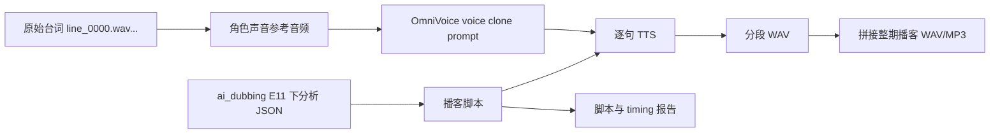
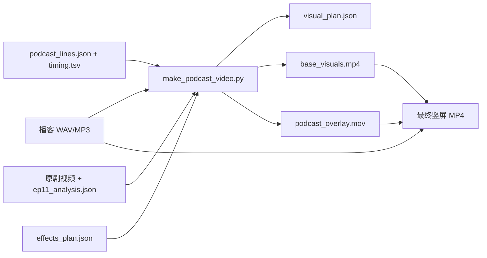

# Podcast Project

这个目录用于把 OmniVoice 当前项目的 TTS 能力封装成一个“播客生成”小工程。第一版目标是用 `/Users/dugenkui/workspace/ai_dubbing` 中已经切好的《甄嬛传》E11 下素材，生成一段“甄嬛版”中文学习播客。

## 当前链路



## 视频化链路

播客视频由 `make_podcast_video.py` 生成。视频画面、说话人、台词卡、单词卡和贴纸效果都已经落到代码和配置里，后续复用时不需要依赖手工操作。



常用命令：

```bash
python3 projects/podcast/make_podcast_video.py \
  --run-name zhenhuan_e11_down_video_full \
  --overwrite
```

贴纸和标签效果配置在 `effects_plan.json`。详细说明见 `video_generation_guide.md`。

当前视频版式会保留顶部安全距，并把圆角视频、说话人、台词卡和单词卡作为一个整体下移。单词卡会写入 `visual_plan.json` 的 `vocab_display_windows`，展示时间会延续到下一个单词卡或非生词段出现。

## 运行方式

先在 OmniVoice 仓库根目录执行：

```bash
uv run python projects/podcast/generate_podcast.py
```

默认会：

- 读取本地模型：`.models/OmniVoice`
- 读取素材：`/Users/dugenkui/workspace/ai_dubbing/test_data/测试输出/.../甄嬛传_E11_下集_教科书级向上管理_曹贵人巧言化解华妃雷霆之怒`
- 输出到：`output/podcast/zhenhuan_e11_down_<时间戳>/`

快速冒烟测试可以只跑前 3 句：

```bash
uv run python projects/podcast/generate_podcast.py --max-lines 3
```

只生成参考素材、脚本和报告，不跑 TTS：

```bash
uv run python projects/podcast/generate_podcast.py --skip-tts
```

## 输出内容

- `refs/*.wav`：用原剧台词拼出来的角色克隆参考音频。
- `segments/*.wav`：每一句播客台词生成出的 TTS 片段。
- `zhenhuan_e11_down_podcast.wav`：拼接后的整期播客。
- `zhenhuan_e11_down_podcast.mp3`：如果本机有 `ffmpeg`，会额外导出 MP3。
- `podcast_script.md`：可读版播客脚本。
- `podcast_lines.json`：结构化播客脚本，记录说话人、参考音频、时长等。
- `timing.tsv`：每句生成耗时、音频时长、RTF 等。

## 设计说明

这里没有改 OmniVoice 主项目代码，而是在 `projects/podcast` 中做项目化封装。这样后面可以继续加：

- 不同剧集的脚本模板。
- 不同角色的参考音频选择策略。
- 更细的情绪控制和非语言标签，如 `[laughter]`、`[sigh]`。
- 自动从 `episode_analyses/*.json` 里生成播客大纲。
