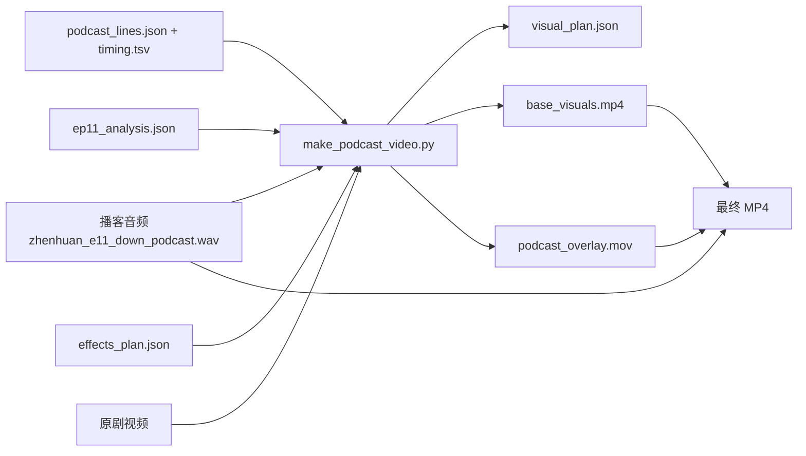
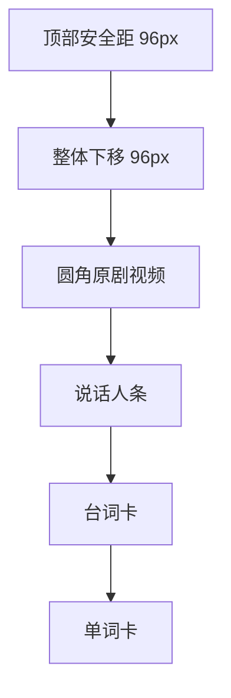
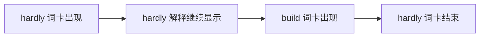
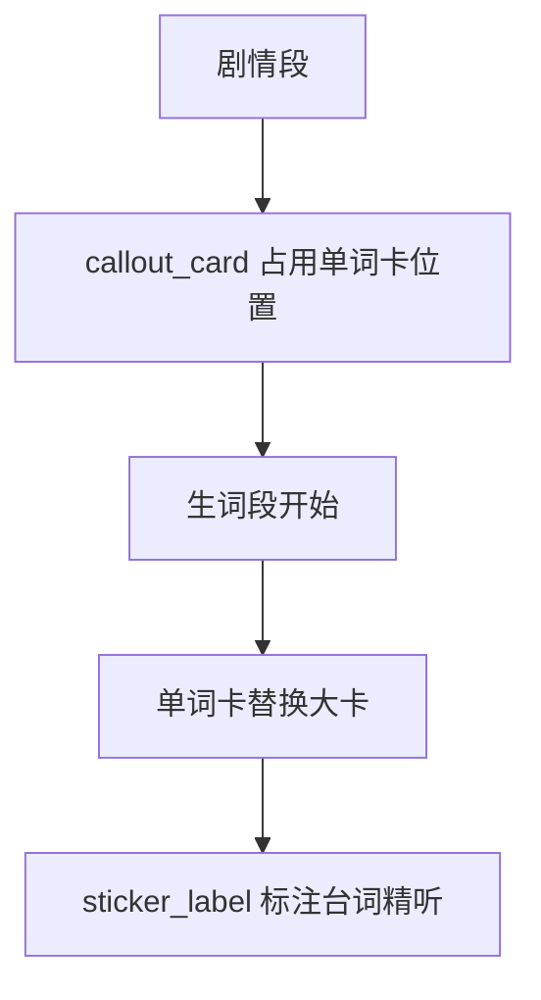
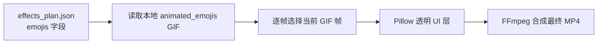
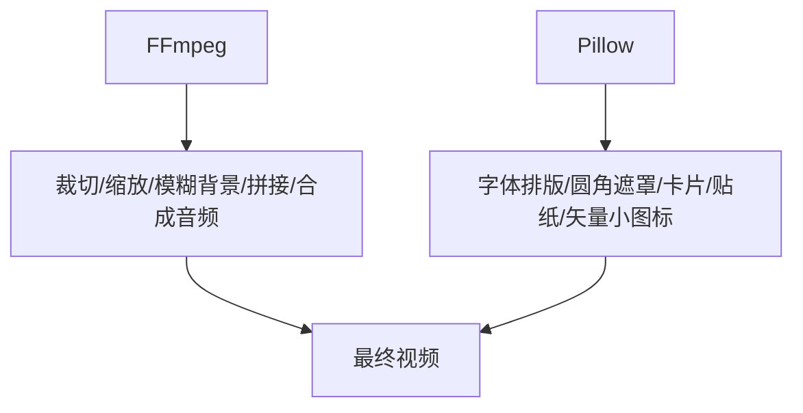

# Podcast Video Generation Guide

这份文档记录“甄嬛播客”从音频变成竖屏短视频的可复用流程。核心原则是：音频是主时间轴，原剧画面、台词卡、单词卡和贴纸效果都跟随音频时间轴渲染。

## 总流程



## 已落到代码里的步骤

`make_podcast_video.py` 已经实现这些步骤：

- 读取 `podcast_lines.json` 和 `timing.tsv`，累加生成每句播客的开始/结束时间。
- 读取 `ep11_analysis.json`，用原剧台词时间戳为播客段落匹配画面。
- 按 `6-12` 秒把播客台词分成视觉段落，写入 `visual_plan.json`。
- 为生词段生成 `vocab_display_windows`，每个单词卡会保留到下一个单词卡或非生词段出现。
- 用 FFmpeg 生成竖屏基础视频：模糊背景 + 上方小尺寸原剧画面。
- 用 Pillow 逐帧生成透明 UI 层：圆角视频遮罩、说话人条、台词卡、单词卡、贴纸标签。
- 用 FFmpeg overlay 合成透明 UI 层和播客音频，输出最终 MP4。

## 版式规则

所有主要模块使用同一个竖向基准：当前视频距离顶部的安全距是 `96px`，本版整体再下移 `96px`。这样发布到抖音时，顶部不会贴边，也不会被系统区域压住。



生词卡不是只跟随一句台词，而是跟随单词学习窗口：



## 贴纸与大卡效果配置

贴纸效果写在 `effects_plan.json`，不是写死在代码里。每条规则可以通过 `line_ids` 绑定播客台词，或通过 `visual_types` 绑定视觉段落类型。

目前有两种效果：

- `callout_card`：明显的大卡效果，出现在单词卡位置。剧情段还没有单词卡时，用它展示“管理员权限被撤”“证据链先行”等梗点。
- `sticker_label`：小标签效果，适合贴在视频或单词卡角落，例如“台词精听”。



```json
{
  "id": "report_plan",
  "effect_type": "callout_card",
  "line_ids": ["008"],
  "text": "带方案来汇报",
  "body": "表面请罪，实际像拿着方案开会。",
  "emojis": ["sweat_smile", "sun_with_face"],
  "icon": "doc",
  "style": "gold",
  "position": "vocab_area",
  "duration_sec": 5.4
}
```

`emojis` 会优先读取 `projects/podcast/assets/animated_emojis/*.gif` 中同名动态表情；找不到时才回退到 `icon` 对应的内置矢量图标。这样“夏日炎炎”可以用 `sun_with_face` + `sweat_smile`，而“权限被撤”可以用 `locked` + `fire`。



动态表情缓存命令：

```bash
python3 projects/podcast/download_animated_emojis.py --limit 260
```

下载脚本会写入 `projects/podcast/assets/animated_emojis/manifest.json`，后续即使网页临时访问不了，也能继续使用已经缓存的 GIF。

支持的内置图标：

- `mic`：开麦/播客现场。
- `book`：单词/知识点。
- `doc`：方案、PPT、汇报。
- `shield`：证据、权限、保全。
- `seat`：赐座、解锁。
- `spark`：默认强调贴纸。

支持的位置：

- `video_top_left`
- `video_top_right`
- `video_bottom_right`
- `caption_top_right`
- `vocab_top_right`
- `vocab_area`：单词卡所在的大卡区域，主要给 `callout_card` 使用。

支持的颜色风格：

- `gold`：知识点、重点解释。
- `pink`：华妃、戏剧张力、包袱。
- `slate`：播客现场、提示标签。

## 运行命令

150 秒预览：

```bash
python3 projects/podcast/make_podcast_video.py \
  --max-duration 150 \
  --run-name zhenhuan_e11_down_video_preview \
  --overwrite \
  --keep-segments
```

完整渲染：

```bash
python3 projects/podcast/make_podcast_video.py \
  --run-name zhenhuan_e11_down_video_full \
  --overwrite
```

指定另一份效果计划：

```bash
python3 projects/podcast/make_podcast_video.py \
  --effects-plan projects/podcast/effects_plan.json \
  --run-name zhenhuan_e11_down_video_with_effects \
  --overwrite
```

## FFmpeg 与 Pillow 的分工



本机 FFmpeg 当前没有 `ass`、`subtitles`、`drawtext` 滤镜，所以字幕和贴纸不走 FFmpeg 原生文字滤镜，而是由 Pillow 生成透明视频层。这种方式速度稍慢，但布局能力更强，也更接近剪映那种卡片/贴纸叠层。
