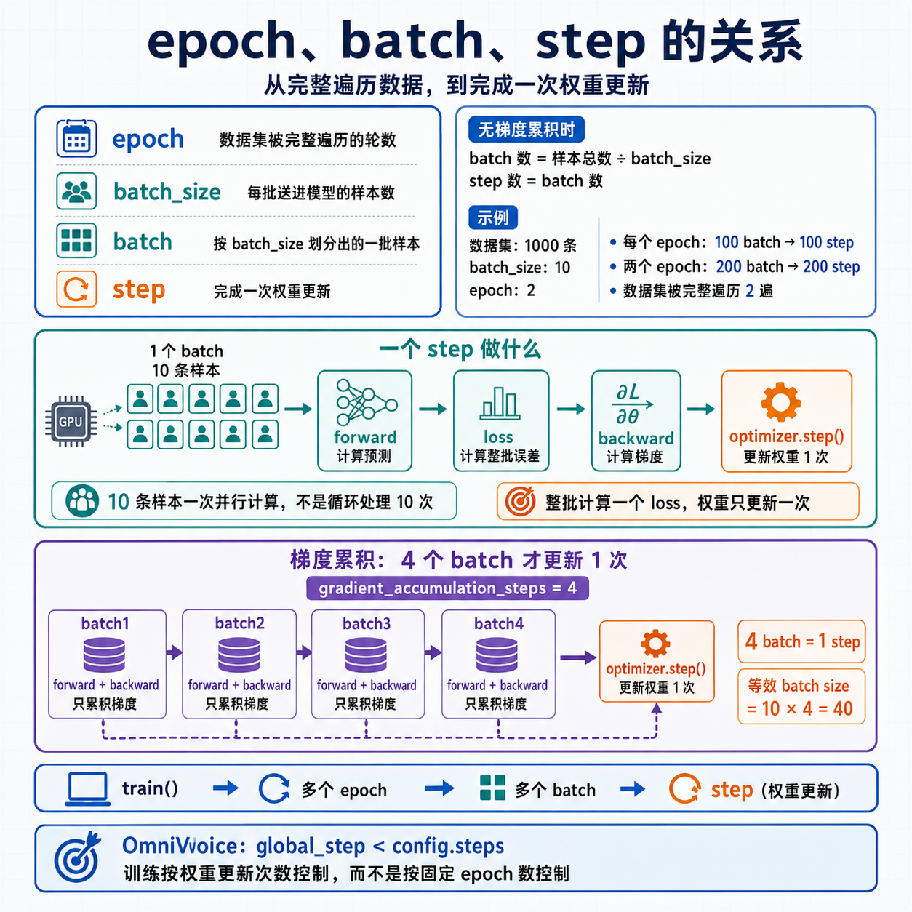
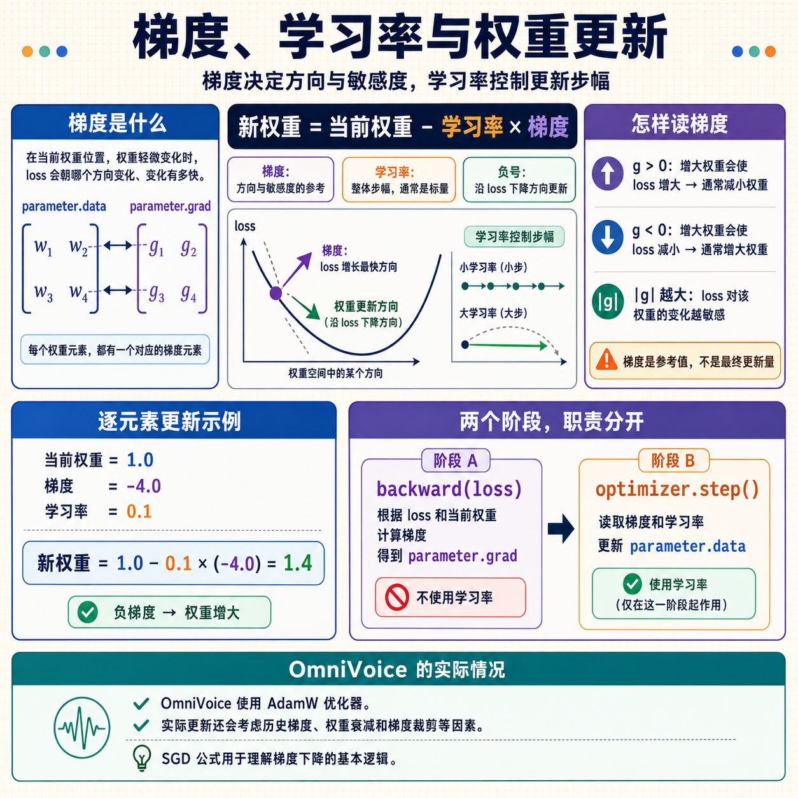

# 模型训练基本流程

## 1. epoch、batch、step 的关系



三个概念分别描述数据的不同维度：

| 概念 | 含义 |
| --- | --- |
| `epoch` | 数据集被完整遍历的轮数 |
| `batch_size` | 每批送进模型的样本数 |
| `batch` | 按 `batch_size` 划分出的一批样本 |
| `step` | 完成一次权重更新 |

数量关系：

```text
batch 数 = 样本总数 ÷ batch_size
step 数 = batch 数（无梯度累积时）
```

举例：

```text
数据集：1000 条
batch_size：10
epoch：2

每个 epoch：1000 ÷ 10 = 100 个 batch → 100 step
两个 epoch：200 个 batch → 200 step，数据集被遍历 2 遍
```

### 一个 step 做什么

```text
取 1 个 batch（10 条样本）
→ forward：计算预测
→ loss：计算误差
→ backward：计算梯度
→ optimizer.step()：更新权重
= 1 step
```

关键点：**这 10 条样本是一次并行计算的**，不是循环处理 10 次。loss 是这一批的整体误差，权重也只更新一次。这正是使用 batch 的原因——充分利用 GPU 的并行能力。

### 梯度累积的例外

显存不足时，可以累积多个 batch 的梯度再更新一次权重：

```text
gradient_accumulation_steps = 4

batch1 → forward + backward（只累积梯度）
batch2 → forward + backward
batch3 → forward + backward
batch4 → forward + backward → optimizer.step() = 1 step
```

此时 4 个 batch 才对应 1 step，等效 batch size 变为 `10 × 4 = 40`。

### 层级总结

```text
1 次 train() 调用
└── 多个 epoch（数据集遍历轮数）
    └── 多个 batch（每批若干样本，并行计算）
        └── step（权重更新次数）
```

> OmniVoice 的训练结束条件是 `global_step < config.steps`，即按权重更新次数控制，而不是按固定 epoch 数控制。

## 2. 梯度、学习率与权重更新



### 梯度是什么

梯度表示：**在当前权重位置，每个权重轻微变化时，loss 会朝哪个方向变化、变化有多快。**

每个权重元素都有一个对应的梯度元素，因此梯度张量与对应的权重张量形状相同：

```text
权重 parameter.data：[[w1, w2], [w3, w4]]
梯度 parameter.grad：[[g1, g2], [g3, g4]]
```

- 梯度为正：增大该权重会使 loss 增大，通常需要减小权重。
- 梯度为负：增大该权重会使 loss 减小，通常需要增大权重。
- 梯度绝对值越大：loss 对该权重的变化越敏感。

梯度是权重调整方向和大小的**参考值**，不是最终的权重更新量。

### 权重更新公式

基础的 SGD 更新公式是：

```text
新权重 = 当前权重 - 学习率 × 梯度
```

这个公式说明：

1. 梯度与对应权重形状相同，可以逐元素计算更新量。
2. 负号表示沿梯度的反方向更新，因为梯度指向 loss 增长最快的方向。
3. 学习率通常是一个标量，用来控制每次权重更新的整体步幅。

例如：

```text
当前权重 = 1.0
梯度 = -4.0
学习率 = 0.1

新权重 = 1.0 - 0.1 × (-4.0) = 1.4
```

### 计算梯度时会使用学习率吗

不会。梯度计算和权重更新是两个阶段：

```text
backward(loss)   → 根据 loss 和当前权重计算梯度，不使用学习率
optimizer.step() → 根据梯度和学习率更新权重
```

OmniVoice 使用 AdamW 优化器，实际更新还会考虑历史梯度、权重衰减和梯度裁剪等因素，因此上面的公式用于理解梯度下降的基本逻辑。
